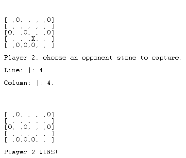

# Identificação do trabalho e do grupo
### Grupo WALI_5
#### Duarte Filipe Campos Barbosa Lopes, up202006408 -> 50%
#### Miguel Ângelo Aguiar e Nogueira, up202005488 -> 50%

# Instalação e Execução
No SICStus correr os seguintes comandos:
- consult({*Directory onde se encontra o programa*}/wali.pl).
- play/0.

# Descrição do jogo
O jogo Wali é composto por duas fases distintas:
- Numa primeira fase, cada jogador coloca uma das suas pedras num espaço à escolha que não pode ser adjacente a uma pedra amiga. Quando um jogador já não consegue fazer nenhum movimento, o outro jogador acaba de colocar as suas pedras até ambos os jogadores não conseguirem ocupar mais casas.
- Na segunda fase, cada jogador tem a oportunidade de mover uma pedra uma casa de cada vez, com o objetivo de fazer um "três em linha" (quatro ou mais em linha não são válidos). Assim que o jogador fizer um "três em linha" pode então capturar uma pedra inimiga à sua escolha.
- Ganha o jogador que conseguir capturar todas as pedras do inimigo.
  
Regras do jogo foram consultadas [aqui](https://www.di.fc.ul.pt/~jpn/gv/wali.htm).

# Lógica do Jogo
## Representação interna do estado do jogo
É utilizado um tabuleiro represetado por uma lista com 30 átomos. Inicialmente fizemos uma lista de listas no entanto, encontra-mos na internet o codigo já feito utilizando apenas uma lista e decidimos então copiar.
## Visualização do estado de jogo
O estado do jogo pode ser visto a cada movimento.
## Execução de Jogadas
A execução de jogadas é feita utlizando o input do utilizador. Na primeira parte, o Utilizador indica repetitivamente uma coluna e uma linha onde quer colocar uma pedra. Na segunda parte o utilizador, indica as coordenadas da pedra que pretende mexer e a direção.
## Lista de Jogadas Válidas
Não existe.
## Final do Jogo
O Final do Jogo acontece quando um dos jogadores ganha.

## Avaliação do Tabuleiro
20/20
## Jogada do Computador
O computador não joga.

# Conclusões
Em suma, o trabalho ficou muito à quem do esperado e não conta com todas as funcionalidades pretendidas. À primeira vista, o jogo em si pode não parecer complicado de entender, mas ao longo do desenvolvimento foram surgindo certas dificuldades em relação a certas regras. Foram também encontradas dificuldades