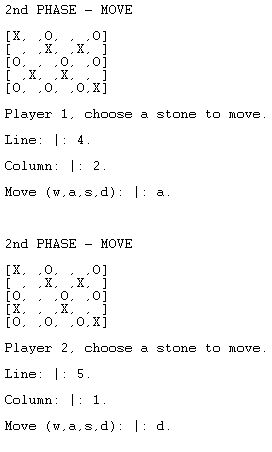

# **Identificação do trabalho e do grupo**
### Grupo **WALI_5**
#### Duarte Filipe Campos Barbosa Lopes, up202006408 -> 50%
#### Miguel Ângelo Aguiar e Nogueira, up202005488 -> 50%
  

# **Instalação e Execução**
No SICStus correr os seguintes comandos:
- consult({*directory_onde_se_encontra_o_programa*}/wali.pl).
- play/0.
  

# **Descrição do jogo**
O jogo Wali é composto por duas fases distintas:
- Numa primeira fase, cada jogador coloca uma das suas pedras num espaço à escolha que não pode ser adjacente a uma pedra amiga. Quando um jogador já não consegue fazer nenhum movimento, o outro jogador acaba de colocar as suas pedras até ambos os jogadores não conseguirem ocupar mais casas.
- Na segunda fase, cada jogador tem a oportunidade de mover uma pedra uma casa de cada vez, com o objetivo de fazer um "três em linha" (quatro ou mais em linha não são válidos). Assim que o jogador fizer um "três em linha" pode então capturar uma pedra inimiga à sua escolha.
- Ganha o jogador que conseguir capturar todas as pedras do inimigo.
  
Regras do jogo foram consultadas [aqui](https://www.di.fc.ul.pt/~jpn/gv/wali.htm).
  

# **Lógica do Jogo**
## **Representação interna do estado do jogo**
É utilizado um tabuleiro represetado por uma lista com 30 átomos. Inicialmente fizemos uma lista de listas no entanto, encontra-mos na internet o codigo já feito utilizando apenas uma lista e decidimos então copiar.
  

## **Visualização do estado de jogo**
O estado do jogo pode ser visto a cada movimento, uma vez que se mostra o tabuleiro e é indicado o jogador que faz o próximo movimento.
  

  
## **Execução de Jogadas**
A execução de jogadas é feita utlizando o input do utilizador. Na primeira parte, o utilizador indica repetitivamente uma coluna e uma linha onde quer colocar uma pedra. Primeiramente, é verificado se essa casa está disponível e de seguida, verifica-se que as suas casas adjacentes não estão ocupadas por uma pedra do mesmo jogador.
  

  
Esta fase continua até não haver mais possibilidade de colocar pedras para nenhum dos jogadores, pode no entanto acontecer um jogador ficar sem jogadas válidas antes do outro.
  

  
Na segunda parte, o utilizador indica as coordenadas da pedra que pretende mover e a direção. Se possuir exatamente três pedras em linha ou coluna pode remover uma das pedras do adversário.
  
 
  

  

## **Final do Jogo**
O Final do Jogo acontece quando um dos jogadores ganha, sendo por exemplo quando o jogador 1 já não tiver mais pedra no tabuleiro.
  

  

# **Conclusões**
À primeira vista, o jogo em si pode não parecer complicado de entender, mas ao longo do desenvolvimento foram surgindo certas dificuldades em relação a regras e certos aspetos do jogo, como ao colocar ou mover as pedras.   
Com mais tempo e uma melhor abordagem, muitos dos predicados usados poderiam eventualmente vir a ser simplificados e mais funcionalidades poderiam vir a ser implementadas.   
Jogar contra o computador poderia também ser implementado, mas a estrutura escolhida inicialmente para fazer a fase um e dois do programa dificulta a implementação das jogados do computador sem ser preciso reescrever tudo ou escrever novos predicados para fases jogadas contra o computador.   
Em suma, o trabalho ficou muito à quem do esperado e não conta com todas as funcionalidades pretendidas.